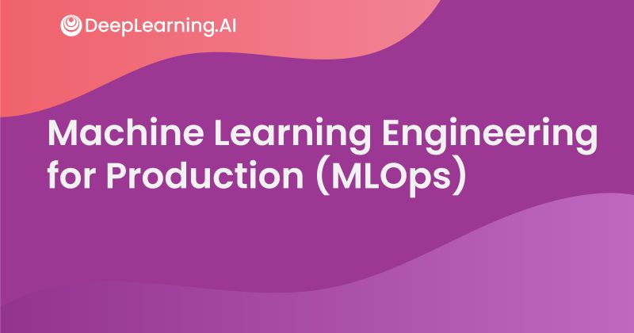

# Machine Learning Engineering for Production (MLOps) Specialization on Coursera (offered by deeplearning.ai)

This specialisation has been temporarily or permanently discontinued in the [deeplearning.ai](https://www.deeplearning.ai/). Hence, I have created this folder in repo to store the PDFs and other relevant files of the courses taught in this specialisation. This is an absolute gem and a must do for MLOps keen enthuasists. Programming assignments from all courses in the Coursera [Machine Learning Engineering for Production (MLOps)] Specialization offered by `deeplearning.ai`.

## Courses

The MLOps Specialization on Coursera contains four courses:

1. [Course 1: Introduction to Machine Learning in Production](https://www.coursera.org/learn/introduction-to-machine-learning-in-production?specialization=machine-learning-engineering-for-production-mlops)

2. [Course 2: Machine Learning Data Lifecycle in Production](https://www.coursera.org/learn/machine-learning-data-lifecycle-in-production?specialization=machine-learning-engineering-for-production-mlops)

3. [Course 3: Machine Learning Modeling Pipelines in Production](https://www.coursera.org/learn/machine-learning-modeling-pipelines-in-production?specialization=machine-learning-engineering-for-production-mlops)

4. [Course 4: Deploying Machine Learning Models in Production](https://www.coursera.org/learn/deploying-machine-learning-models-in-production?specialization=machine-learning-engineering-for-production-mlops)

## Why this Specialization? 
- Become a Machine Learning expert. Productionize your machine learning knowledge and expand your production engineering capabilities.

- **Skills:** Managing Machine Learning Production Systems, Deployment Pipelines, Model Pipelines, Data Pipelines, Machine Learning Engineering for Production, Human-level Performance (HLP), Concept Drift, Model Baseline, Project Scoping and Design, ML Deployment Challenges, ML Metadata, Convolutional Neural Network

- **Level:** Advanced
	- Some knowledge of AI / deep learning
	- Intermediate skills in Python
	- Experience with any deep learning framework (PyTorch, Keras, or TensorFlow)

## About this Specialization

- Understanding machine learning and deep learning concepts is essential, but if you’re looking to build an effective AI career, you need production engineering capabilities as well. 

- Effectively deploying machine learning models requires competencies more commonly found in technical fields such as software engineering and DevOps. Machine learning engineering for production combines the foundational concepts of machine learning with the functional expertise of modern software development and engineering roles. 

- The Machine Learning Engineering for Production (MLOps) Specialization covers how to conceptualize, build, and maintain integrated systems that continuously operate in production. In striking contrast with standard machine learning modeling, production systems need to handle relentless evolving data. Moreover, the production system must run non-stop at the minimum cost while producing the maximum performance. In this Specialization, you will learn how to use well-established tools and methodologies for doing all of this effectively and efficiently.

- In this Specialization, you will become familiar with the capabilities, challenges, and consequences of machine learning engineering in production. By the end, you will be ready to employ your new production-ready skills to participate in the development of leading-edge AI technology to solve real-world problems.

## Applied Learning Project

By the end, you'll be ready to:
- Design an ML production system end-to-end: project scoping, data needs, modeling strategies, and deployment requirements
- Establish a model baseline, address concept drift, and prototype how to develop, deploy, and continuously improve a productionized ML application
- Build data pipelines by gathering, cleaning, and validating datasets
- Implement feature engineering, transformation, and selection with TensorFlow Extended
- Establish data lifecycle by leveraging data lineage and provenance metadata tools and follow data evolution with enterprise data schemas
- Apply techniques to manage modeling resources and best serve offline/online inference requests
- Use analytics to address model fairness, explainability issues, and mitigate bottlenecks
- Deliver deployment pipelines for model serving that require different infrastructures
- Apply best practices and progressive delivery techniques to maintain a continuously operating production system
   
## Course Structure
Each course is spread out in weeks, and are made up of video slides, lab sessions, quizzes, assignments, related course materials, code and data, and all are uploaded in the respective modules of each courses constituting the specialisation. The copyright of all the contents belong to Deeplearning.ai team.

## Course 1: Machine Learning in Production

### About this Course
In this Machine Learning in Production course, you will build intuition about designing a production ML system end-to-end: project scoping, data needs, modeling strategies, and deployment patterns and technologies. You will learn strategies for addressing common challenges in production like establishing a model baseline, addressing concept drift, and performing error analysis. You’ll follow a framework for developing, deploying, and continuously improving a productionized ML application.

Understanding machine learning and deep learning concepts is essential, but if you’re looking to build an effective AI career, you need experience preparing your projects for deployment as well. Machine learning engineering for production combines the foundational concepts of machine learning with the skills and best practices of modern software development necessary to successfully deploy and maintain ML systems in real-world environments.

### Week 1: Overview of the ML Lifecycle and Deployment
This week covers a quick introduction to machine learning production systems focusing on their requirements and challenges. Next, the week focuses on deploying production systems and what is needed to do so robustly while facing constantly changing data.

### Learning Objectives
- Identify the key components of the ML Lifecycle.
- Define “concept drift” as it relates to ML projects.
- Differentiate between shadow, canary, and blue-green deployment scenarios in the context of varying degrees of automation.
- Compare and contrast the ML modeling iterative cycle with the cycle for deployment of ML products.
- List the typical metrics you might track to monitor concept drift.
  
#### Slides
- [Machine Learning Project Life Cycle](C1-Introduction-to-machine-learning-in-production/Week1/C1_W1.pdf)
  
#### Labs
- [Deploying a Machine Learning Model](C1-Introduction-to-machine-learning-in-production/Week1/server.ipynb)
- [Consuming a Machine Learning Model](C1-Introduction-to-machine-learning-in-production/Week1/client.ipynb)

### Week 2: Selecting and Training a Model
This week is about model strategies and key challenges in model development. It covers error analysis and strategies to work with different data types. It also addresses how to cope with class imbalance and highly skewed data sets.

### Learning Objectives
- Identify the key challenges in model development.
- Describe how performance on a small set of disproportionately important examples may be more crucial than performance on the majority of examples.
- Explain how rare classes in your training data can affect performance.
- Define three ways of establishing a baseline for your performance.
- Define structured vs. unstructured data.
- Identify when to consider deployment constraints when choosing a model.
- List the steps involved in getting started with ML modeling.
- Describe the iterative process for error analysis.
- Identify the key factors in deciding what to prioritize when working to improve model accuracy.
- Describe methods you might use for data augmentation given audio data vs. image data.
- Explain the problems you can have training on a highly skewed dataset.
- Identify a use case in which adding more data to your training dataset could actually hurt performance.
- Describe the key components of experiment tracking.

#### Slides
- [Select and train a Model](C1-Introduction-to-machine-learning-in-production/Week2/C1_W2.pdf)
  
#### Labs
- [Ungraded Lab: A journey through Data](C1-Introduction-to-machine-learning-in-production/Week2/C1W2_Ungraded_Lab_Birds_Cats_Dogs.ipynb)
- [Ungraded Lab: Data Labeling](C1-Introduction-to-machine-learning-in-production/Week2/C1W3_Data_Labeling_Ungraded_Lab.ipynb)

### Week 3: Data Definition and Baseline
This week is all about working with different data types and ensuring label consistency for classification problems. This leads to establishing a performance baseline for your model and discussing strategies to improve it given your time and resources constraints.

### Learning Objectives
- List the questions you need to answer in the process of data definition.
- Compare and contrast the types of data problems you need to solve for structured vs. unstructured and big vs. small data.
- Explain why label consistency is important and how you can improve it
- Explain why beating human level performance is not always indicative of success of an ML model.
- Make a case for improving human level performance rather than beating it.
- Identify how much training data you should gather given time and resource constraints.
- Describe the key steps in a data pipeline.
- Compare and contrast the proof of concept vs. production phases on an ML project.
- Explain the importance of keeping track of data provenance and lineage.

#### Slides
- [Define data and establish baseline](C1-Introduction-to-machine-learning-in-production/Week3/C1_W3.pdf)
  
#### Labs
- [Ungraded Lab: Data Labeling](C1-Introduction-to-machine-learning-in-production/Week3/C1W3_Data_Labeling_Ungraded_Lab.ipynb)

## Course 2: Machine Learning Data Life Cycle in Production

### Week 1
#### Slides
- [Collecting, Labeling, and Validating Data](C2-Machine-learning-data-life-cycle-in-production/Week1/C2_W1.pdf)
#### Labs
- [Ungraded Lab: TFDV Exercise](C2-Machine-learning-data-life-cycle-in-production/Week1/C2_W1_Lab_1_TFDV_Exercise.ipynb)
#### Assignments
- [Assignment: Data Validation](C2-Machine-learning-data-life-cycle-in-production/Week1/C2W1_Assignment.ipynb)

### Week 2
#### Slides
- [Feature Engineering, Transformation and Selection](C2-Machine-learning-data-life-cycle-in-production/Week2/C2_W2.pdf)
#### Labs
- [Ungraded Lab: Simple Feature Engineering](C2-Machine-learning-data-life-cycle-in-production/Week2/C2_W2_Lab_1_Simple_Feature_Engineering.ipynb)
- [Ungraded Lab: Feature Engineering Pipeline](C2-Machine-learning-data-life-cycle-in-production/Week2/C2_W2_Lab_2_Feature_Engineering_Pipeline.ipynb)
- [Ungraded Lab: Feature Selection](C2-Machine-learning-data-life-cycle-in-production/Week2/C2_W2_Lab_3_Feature_Selection.ipynb)

### Week 3
#### Slides
- [Data Journey and Data Storage](C2-Machine-learning-data-life-cycle-in-production/Week3/C2_W3.pdf)
#### Labs
- [Ungraded Lab: Walkthrough of ML Metadata](C2-Machine-learning-data-life-cycle-in-production/Week3/C2_W3_Lab_1_MLMetadata.ipynb)
- [Ungraded Lab: Iterative Schema with TFX and ML Metadata](C2-Machine-learning-data-life-cycle-in-production/Week3/C2_W3_Lab_2_IterativeSchema.ipynb)
#### Assignments
- [Week 3 Assignment: Data Pipeline Components for Production ML](C2-Machine-learning-data-life-cycle-in-production/Week3/C2W3_Assignment.ipynb)

### Week 4
#### Slides
- [Advanced Labeling, Augmentation and Data Preprocessing](C2-Machine-learning-data-life-cycle-in-production/Week4/C2_W4.pdf)
#### Labs
- [Ungraded Lab: Feature Engineering with Weather Data](C2-Machine-learning-data-life-cycle-in-production/Week4/C2_W4_Lab_1_WeatherData.ipynb)
- [Ungraded Lab: Feature Engineering with Accelerometer Data](C2-Machine-learning-data-life-cycle-in-production/Week4/C2_W4_Lab_2_Signals.ipynb)
- [Ungraded Lab: Feature Engineering with Images](C2-Machine-learning-data-life-cycle-in-production/Week4/C2_W4_Lab_3_Images.ipynb)

## Course 3: Machine Learning Modelling Pipelines in Production

### Week 1
#### Slides
- [Neural Architecture Search](C3-Machine-learning-modelling-pipelines-in-production/Week1/C3_W1.pdf)
#### Labs
- [Ungraded Lab: Intro to Keras Tuner](C3-Machine-learning-modelling-pipelines-in-production/Week1/C3_W1_Lab_1_Keras_Tuner.ipynb)
- [Ungraded Lab: Hyperparameter tuning and model training with TFX](C3-Machine-learning-modelling-pipelines-in-production/Week1/C3_W1_Lab_2_TFX_Tuner_and_Trainer.ipynb)

### Week 2
#### Slides
- [Model Resource Management Techniques](C3-Machine-learning-modelling-pipelines-in-production/Week2/C3_W2.pdf)
#### Labs
- [Ungraded lab: Manual Feature Engineering](C3-Machine-learning-modelling-pipelines-in-production/Week2/C3_W2_Lab_1_Manual_Dimensionality.ipynb)
- [Ungraded lab: Algorithmic Dimensionality Reduction ](C3-Machine-learning-modelling-pipelines-in-production/Week2/C3_W2_Lab_2_Algorithmic_Dimensionality.ipynb)
- [Ungraded Lab: Quantization and Pruning](C3-Machine-learning-modelling-pipelines-in-production/Week2/C3_W2_Lab_3_Quantization_and_Pruning.ipynb)

### Week 3
#### Slides
- [High Performance Modeling](C3-Machine-learning-modelling-pipelines-in-production/Week3/C3_W3.pdf)
#### Labs
- [Ungraded lab: Distributed Strategies with TF and Keras](C3-Machine-learning-modelling-pipelines-in-production/Week3/C3_W3_Lab_1_Distributed_Training.ipynb)
- [Ungraded Lab: Knowledge Distillation](C3-Machine-learning-modelling-pipelines-in-production/Week3/C3_W3_Lab_2_Knowledge_Distillation.ipynb)
- [Ungraded lab: Distributed Strategies with TF and Keras](C3-Machine-learning-modelling-pipelines-in-production/Week3/C3W3_Colab_Lab1_Distributed_Training.ipynb)

### Week 4
#### Slides
- [Model Analysis](C3-Machine-learning-modelling-pipelines-in-production/Week4/C3_W4.pdf)
#### Labs
- [Ungraded Lab: TensorFlow Model Analysis](C3-Machine-learning-modelling-pipelines-in-production/Week4/C3_W4_Lab_1_TFMA.ipynb)
- [Ungraded Lab: Model Analysis with TFX Evaluator](C3-Machine-learning-modelling-pipelines-in-production/Week4/C3_W4_Lab_2_TFX_Evaluator.ipynb)
- [Ungraded Lab: Fairness Indicators](C3-Machine-learning-modelling-pipelines-in-production/Week4/C3_W4_Lab_3_Fairness_Indicators.ipynb)

### Week 5
#### Slides
- [Interpretability](C3-Machine-learning-modelling-pipelines-in-production/Week5/C3_W5.pdf)
#### Labs
- [Ungraded lab: Shapley Values](C3-Machine-learning-modelling-pipelines-in-production/Week5/C3_W5_Lab_1_Shap_Values.ipynb)
- [Ungraded lab: Permutation Feature Importance](C3-Machine-learning-modelling-pipelines-in-production/Week5/C3_W5_Lab_2_Permutation_Importance.ipynb)

## Course 4: Welcome to Deploying Machine Learning Models in Production

### Week 1
#### Slides
- [Model Serving](C4-Welcome-to-deploying-machine-learning-models-in-production/Week1/C4_W1.pdf)
#### Labs
- [Ungraded lab: Serve a model with TensorFlow Serving](C4-Welcome-to-deploying-machine-learning-models-in-production/Week1/C4_W1.pdf)

### Week 2
#### Slides
- [Model Serving Architecture](C4-Welcome-to-deploying-machine-learning-models-in-production/Week1/C4_W1.pdf)
#### Labs
- [Ungraded Lab (Optional): ETL Pipelines and Batch Predictions with Apache Beam and Tensorflow](C4-Welcome-to-deploying-machine-learning-models-in-production/Week2/C4_W2_Lab_4_ETL_Beam/C4_W2_Lab_4_Apache_Beam_and_Tensorflow.ipynb)

### Week 3
#### Slides
- [Model Management and Delivery](C4-Welcome-to-deploying-machine-learning-models-in-production/Week3/C4_W3.pdf)
#### Labs
- [Ungraded Lab: Building ML Pipelines with Kubeflow](C4-Welcome-to-deploying-machine-learning-models-in-production/Week3/C4_W3_Lab_1_Kubeflow_Pipelines.ipynb)
- [Ungraded Lab: Developing Custom TFX Components](C4-Welcome-to-deploying-machine-learning-models-in-production/Week3/C4_W3_Lab_2_TFX_Custom_Components.ipynb)

### Week 4
#### Slides
- [Model Monitoring](C4-Welcome-to-deploying-machine-learning-models-in-production/Week4/C4_W4.pdf)

## Disclaimer
The code assignments are provided here serve solely as reference. They are intended to assist you in overcoming any obstacles you may encounter. Please refrain from directly copying any code segments, as the programming assignments are straightforward when the instructions are thoroughly understood. Likewise, it's recommended to attempt the quizzes independently before consulting the quiz solutions.