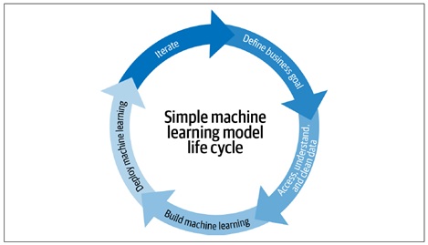

This repo contains all learning notes, resources and assignments completed in IISc CCE course on Applied AI-ML and MLOps

# Understanding the basics of MLOps and Integration of MLOps, DevOps, DataOps and ModelOps

Due to surge of implementing the machine learning models in solving business problems, Machine Learning Operations, or MLOps are becoming popular. It is a emerging trend implemented by the organizations and business leaders to generate long-term value and reduce risk associated with data science, machine learning, and AI initiatives. It addresses the unique challenges that organizations face when deploying machine learning models into production environments. MLOps is the bridge that connects data science and DevOps, enabling organizations to streamline the development, deployment, and maintenance of machine learning systems. This essay will delve into the fundamentals of MLOps, its lifecycle, and the integration of DevOps, DataOps, and ModelOps to create a cohesive and efficient framework for managing machine learning projects.

## 1.1 Defining MLOps
Machine learning (ML) has evolved from the mix of domains: Utilizing the statistics domain to alter, test, describe and infer the data to become useable, then implementing the mathematical  optimization theory to run different models to learn from the past data so it can predict the outcomes in future to a certain accuracy. With the advent of HPC and coding friendly interpreter language like Python, ML has become a transformative force in various industries, including finance, healthcare, marketing, and manufacturing. The Fig 1 displays the typical ML model life cycle [1]

Fig 1: A typical ML model life cycle implemented.

Until recently, the number of models were manageable for a small data. There was simply less interest in understanding these models and their dependencies at a company-wide level. But as organizations increasingly adopt machine learning to derive insights from the big data, and consequently automate the decision-making, models become more critical, and, in parallel, managing model risks becomes more important at the top level. Thus, the need for a structured approach to managing ML projects has become evident. MLOps was born out of this necessity.

MLOps is heavily derived from the DevOps concept in software engineering. MLOps is the process of applying established best practices used in DevOps to the machine learning models, to design, build, deploy, monitor, and manage the models in production. In short, think of MLOps as the process of automating machine learning using DevOps methodologies .

It brings together cross-functional teams, processes, and robust automation tools to create a cohesive pipeline that spans the entire machine learning lifecycle (build, test, release). The key objectives of MLOps include ensuring model reproducibility, scalability, and reliability while minimizing risks associated with model deployment. 

## 1.2 The MLOps Lifecycle
The MLOps lifecycle consists of several interconnected stages, each with its unique challenges and considerations. The following stages provide a general overview of the MLOps lifecycle:

### 1. Problem Definition
This stage focuses on attaining a clear understanding of the business problem that machine learning aims to solve. Data scientists work closely with Subject Matter Experts (SMEs) to define objectives, success criteria, data requirements and sources. This stage emphasizes the importance of high-quality data, which serves as the lifeblood of any machine learning model.

### 2. Data Acquisition, Preprocessing and Feature Engineering
After acquiring data from various sources, preprocessing involves cleaning, transforming, and preparing raw data for model training. Feature engineering, a crucial step, involves selecting and creating relevant features that capture the underlying patterns in the data. Data Engineers and Scientists play the vital role here.

### 3. Model Development and Training
Data scientists and ML engineers experiment with various algorithms, model architectures, and hyperparameters to develop the best-performing model. Model selection, validation, and tuning are iterative processes that require collaboration and experimentation. Once the model is designed, it undergoes training using historical data. This stage may involve distributed computing and the need for specialized hardware, depending on the complexity of the model. Data versioning and lineage tracking are essential for reproducibility.

### 4. Model Evaluation
Evaluating the model’s performance is a critical step. Data scientists use various metrics and techniques to assess the model's accuracy, precision, recall, and other relevant criteria. Model explainability is another aspect that gains prominence, especially in regulated industries.

### 5. Model Testing for Production
Once the model is evaluated for the datasets, it is tested this time, in the runtime environment at small-scale, to evaluate any risks and for quality assurance. Following tests are usually implemented in the pipeline, i.e., Unit tests, integration tests, coverage tests, performance tests, load tests, privacy tests, security tests, and bias tests. This stage is handled by Data engineers, software engineers, and ML architects.

### 6. Model Deployment
Deploying a machine learning model into production is often the most challenging and error-prone phase of the MLOps lifecycle. DevOps practices, such as continuous integration and continuous deployment (CI/CD), are integrated to automate the deployment pipeline, ensuring that models are consistently and reliably deployed into production environments.

### 7. Model Monitoring and Maintenance
Once deployed, models need continuous monitoring to detect and address performance degradation, concept drift, and other issues. This phase is where DataOps and ModelOps converge, as teams collaborate to ensure models remain accurate and compliant.

### 8. Model Retraining
Machine learning models are not static; they require periodic retraining to adapt to changing data distributions and patterns. ModelOps practices facilitate the seamless retraining of models while maintaining production stability.

### 9. Model Documentation and Governance
Documentation and governance are essential for model transparency, accountability, and compliance. Data lineage, model versioning, and metadata management are crucial components of this stage.

### 10. Model Decommissioning
At the end of their lifecycle or when they no longer provide value, models need to be decommissioned. This phase involves retiring models, archiving data, and ensuring a clean exit from production systems.

![Fig  2: Typical MLOps life cycle implemented in the industry [1]](images/Picture_2.png)

Fig  2: Typical MLOps life cycle implemented in the industry [1]

## 2. Integration of MLOps, DevOps, DataOps & ModelOps

### 2.1 The Role of DevOps in MLOps
DevOps, a set of practices that combine software development (Dev) and IT operations (Ops), is a foundational component of MLOps. DevOps principles, such as automation, collaboration, and continuous integration/continuous deployment (CI/CD), are applied to machine learning workflows to accelerate model deployment and minimize deployment risks. Here are some keyways in which DevOps is integrated into MLOps [2]:

### 1. Automation
Automation is the core of DevOps, and it is equally essential in MLOps. Automated pipelines are used to build, test, and deploy machine learning models. This reduces the risk of human error and ensures that deployments are consistent and repeatable.

### 2. CI/CD Pipelines
Continuous integration (CI) and continuous deployment (CD) pipelines are adapted for machine learning workflows. These pipelines automate the testing and deployment of models as soon as upgraded versions become available, enabling the organizations to deliver value to end-users more rapidly [1,2].

### 3. Version Control
Version control systems, such as Git, are used to track changes in code, data, and model files. This facilitates collaboration among data scientists and machine learning engineers and enables the rollback to previous model versions if issues arise.

### 4. Deployment as IaC
Infrastructure as Code (IaC) practices are applied to machine learning infrastructure. This ensures that the necessary computing resources, such as virtual machines and containers, can be provisioned and scaled automatically based on demand [2]. 
Some other popular modes of deployments are Container as a Service (CaaS), or Platform as a Service (PaaS). Also, TensorFlow Serve, 
PyTorch Serve, or services like SageMaker and Vertex AI to deploy your model services [5].

### 5. Collaboration
DevOps encourages cross-functional collaboration, and MLOps is no exception. Data scientists, machine learning engineers, data engineers, and operations teams work together to streamline the model development and deployment process [1].

## 2.2 The Role of DataOps in MLOps
DataOps is a set of practices and technologies that emphasize on the automation of data operations, and collaboration in data professionals, including data scientists and data engineers. DataOps seeks to provide business-ready data that is quickly available for use, with a large focus on data quality and metadata management. For example, if there’s a sudden change in data that a model relies on, a DataOps system would alert the business team to deal more carefully with the latest insights, and the data team would be notified to investigate the change or revert a library upgrade and rebuild the related partition [1]. In the context of MLOps, DataOps plays a crucial role in ensuring data quality, lineage, and accessibility. Here are some keyways in which DataOps is integrated into MLOps:

### 1. Data Quality
DataOps practices focus on data quality assurance. Data pipelines are designed to validate, clean, and transform data, ensuring that it meets the requirements of machine learning models.

### 2. Data Lineage
Understanding the lineage of data is essential for ensuring that models are trained on the right data and that their predictions can be traced back to the source. Data lineage tools help track data from its origin to its consumption.

### 3. Data Catalogs
Data catalogs provide a centralized repository for metadata about datasets, making it easier for data scientists to discover and access the data they need for model development.

### 4. Collaboration
DataOps promotes collaboration between data professionals and other stakeholders. Data scientists work closely with data engineers to create and maintain data pipelines, ensuring a seamless flow of data to and from machine learning models.

## 2.3 The Role of ModelOps in MLOps
ModelOps, an extension of DevOps and MLOps, focuses specifically on the management of machine learning models in production. Basically, ModelOps is a collection of tools, technologies, and best practices to deploy, monitor and manage machine learning models [4]. It addresses challenges related to model monitoring, governance, scaling and automation at enterprise level. However, it is argued that ModelOps is not focused just on ML models but any models, like knowledge graphs, rules, optimization, natural language techniques and agents [4].
The focus of ModelOps is to keep deployed models ready for the future with continuous re-training and synchronized deployments. Here are some keyways in which ModelOps is integrated into MLOps:

### 1.	Generating Model Pipeline 
ModelOps platforms generate a pipeline automatically with least human interaction. Once it is established, the whole modelling lifecycle – preparing data, selecting models, feature engineering, hyperparameter optimization, will be automated.

### 2.	Model Monitoring
ModelOps teams are responsible for monitoring deployed models in real-time. They track model performance, identify anomalies, and take corrective actions to maintain model accuracy.

### 3. Governance and Compliance
Ensuring that models adhere to regulatory and compliance requirements is a critical aspect of ModelOps. Model documentation, explainability, and auditing are key components.

### 4. Model Automation
ModelOps teams automate various aspects of model management, including deployment, retraining, and scaling. This ensures that models remain up-to-date and responsive to changing conditions. 
ModelOps automation tools may include MLflow for model tracking and versioning, Prometheus for monitoring, and custom deployment scripts or tools designed for ML model deployment.

## 2.3	Overview of integration of MLOps, DataOps, DevOps & ModelOps

Overall, MLOps cycle is culmination of building Machine learning models combined with well-established practices and tools of DataOps, DevOps and ModelOps, as shown in the fig 3. Model Development and Software Development are stitched together into unified Machine Learning Life Cycle.

Fig 3:  MLOps life cycle

### CITATIONS
[1] Introducing MLOps, by Mark Treveil, and the Dataiku Team

[2] Designing Machine Learning Systems, by Chip Huyen 

[3] Practical MLOps, by Noah Gift and Alfredo Deza

[4] https://neptune.ai/blog/modelops

[5] https://www.ml4devs.com/articles/mlops-machine-learning-life-cycle
